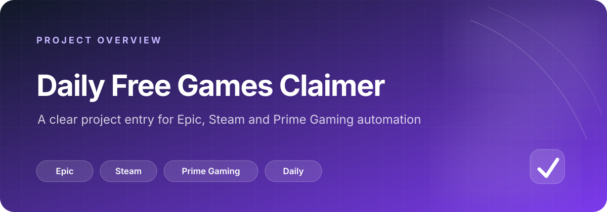

# daily-free-games-claimer

  

  
  
  

## 一眼看懂

| 项目 | 说明 |
| --- | --- |
| 目标 | 每日自动领取 Epic、Steam 与 Prime Gaming 的免费游戏 |
| 当前首页 | 已明确项目方向，但尚未给出安装、配置、凭据或可执行入口 |
| 阅读方式 | 先确认支持平台，再根据后续实现补充工作流与运行说明 |
| 文档原则 | 不虚构仓库中尚未出现的命令、配置项或成功率 |

> 当前仓库适合作为项目入口页。加入实际实现后，建议优先补充入口文件、所需凭据、触发频率和失败处理方式。

---

每日自动领取 Epic / Steam / Prime Gaming 免费游戏
